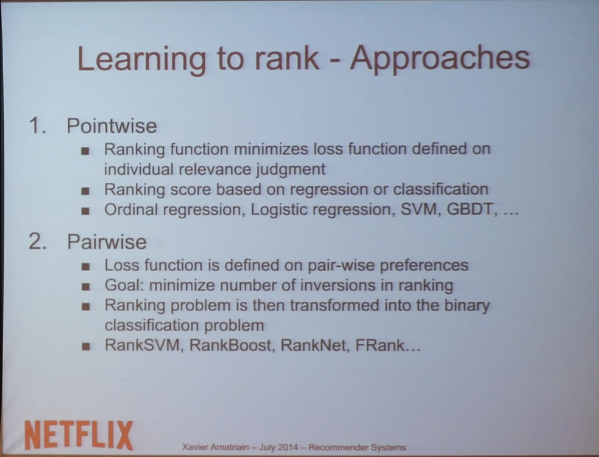

# 추천시스템 
# CMU by Netflix 

## Ranking 

- 단순히 rating으로만 나열하면 정말 인기없는데 rating이 높은 것이 앞에 올 것이다. 여러가지 features들을 고려하게 된다 
- RMSE 는 이러한 이유로 ranking 에서 사용되지 않음 
- 만약에 popularity 는 unpersonized 된 feature 고 
- predicted ranking 는 personized feature이다 
- 이 두가지 피쳐들의 linear function을 구하고 이를 토대로 ranking하는 방법이 제일 심플하게 접근할 수 있는 방법일 것이다 
- A/B test를 통해서 이 linear function 을 구할 수도 있다. 

## Learning to rank 

### Metrics 

- NDCG : Normalized Discounted Cumulative Gain 
- MRR : Mean Reciprocal Rank 
- FCP : Faction of Concordant Pairs 
- 이러한 지표들을 사용할 수 있으나 미분불가능하고 까다로운 metrics 
- Pointwise Approaches 
- Pairwise Approaches 
- Minumize number of inversions 
- Item A has to be better than B 

 

- Listwise Optimization 
- 모든 list에 대해서 최적화할 수 있을까? 
- RankCosine 
- Ranking list and ground truth 유사도 
- Gradient Descent, Simulated Annealing 방법을 사용해서 loss function 최적화를 한다 

### Context-aware Recommendations 

- Content가 personalization을 위해서 중요한데 
- Time, place, weather 와 같은 것들 말이다 
- Pre-Filtering : Context로 데이터를 먼저 필터링한다 
- Contextual Post-Filtering 
- **Contextual Modeling** 
- User - Item 2D dimensions 이 Multi-dimensional Problem이 되어버림 
- Time, Company ... 등등의 값도 생김 
- **Very Sparse** 
- **Tensor Factorization** 
- Matrix Factorization이랑 매우 비슷함 higher order 버전임. 
- Higher Order Singular Value Decomposition 

 

- Context를 추가하니까 MAE가 줄어듦. 상황을 추가하는 것도 좋은 방법 중 하나임.
