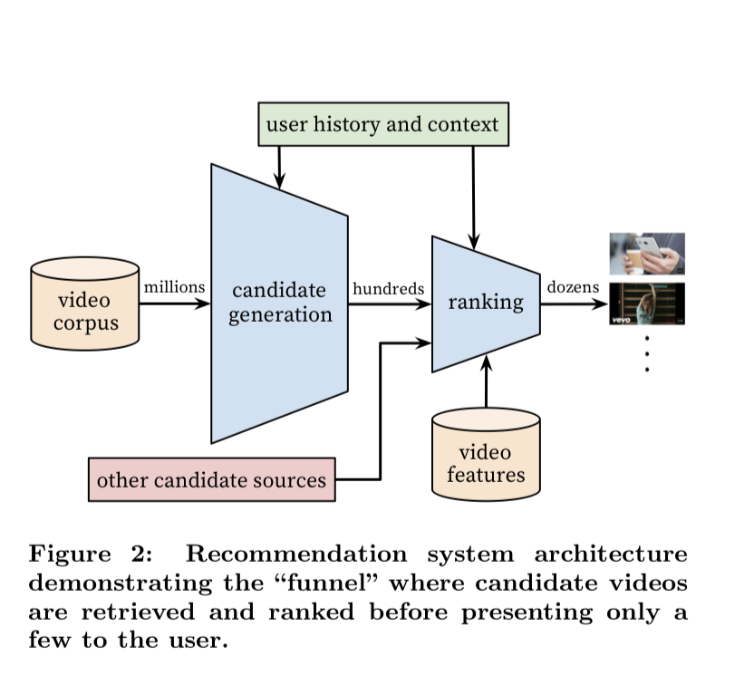

# Deep Neural Networks for Youtube Recommendation

- candidate generation model
- deep ranking model

# Introduction

## 3가지 Perspectives

### Scale

- 유투브 사용자 스케일이 매우 크기 때문에 기존의 작은 규모의 문제에서 잘 동작했던 추천 모델들이 유투브에 적용했을 때의 성능이 매우 좋지 않았고, 이를 위해서 큰 규모의 데이터를 핸들링할 방법이 중요했음

### Freshness

- 1초에도 수많은 content가 올라오고 있기 때문에 dynamic 한 corpus.
- exploration/exploitation 를 잘 해야함

### Noise

- Sparsity 나 관측되지 않는 노이즈 때문에 고생스러움
- 또한 content의 meta데이터도 좋지 않음

## 기타

- Tensorflow 사용함
- 1억개에 가까운 parameter수를 hundred of billions of example 에 훈련시켰음

# 2. System Overview

### Candidate Generation

Youtube 에서의 유저의 활동을 받아 수백개의 후보 비디오를 결과로 내뱉는 모델이다 

- User가 본 Video ID들, 검색 쿼리, 유저의 데모 정보를 사용했다

### Ranking

수백 개의 비디오에 score를 부여하고 제일 점수가 높은 비디오들을 차례로 내뱉는다 

- 이 단계를 나누어서 device에는 작은 수의 비디오만 나오게 하면서,  다른 결과값들과 잘 섞일 수 있게 만들었다

오프라인에서는 recall, ranking loss, precison 등을 사용했지만 최종 선택에 있어서는 CTR, watch time 등의 실제 지표를 가지고 A/B 테스트를 실행했다 

# 3. Candidate generation

얕은 네트워크를 가지고 유저의 비디오 시청 이력을 임베딩했고 이는 a matrix factorization approach trained under rank loss 를 모방했다고 말할 수 있을 것이다. 

## 3.1 Recommendation as Classification

추천은 엄청 많은 multiclass 분류기라고 볼 수 있다. 

유저의 context와 비디오 이력을 통해서 user와 비디오를 임베딩한다

그리고 explicit feedback이 아닌 영상을 다 본 기록, 즉 implicit feedback을 사용한다 

### Efficient Extreme Multiclass

- 비디오의 수가 너무 많기 때문에 candidate sampling을 통해서 후보를 추출하고
- ([https://www.aclweb.org/anthology/P15-1001/](https://www.aclweb.org/anthology/P15-1001/))

## 3.2 Model Architecture

- high dimensional embeddings을 FFN에 먹이는 구조이다
- 임베딩 후 평균을 내고, 학습 중에 임베딩도 같이 업데이트하는 구조로 만들었다

## 3.3 Heterogeneous Signal

- 딥러닝의 장점은 매우 이질적인 feature들을 단순히 concatenate 시켜서 학습에 사용할 수 있다는 점이다
    - 이러한 점은 learning to rank에서 나온 tensor factorization 기법을 사용하는 것보다 용이하다
- 예를들어 나이를 feature로 사용한다고 했을 때 단순히 [0,1]을 normalizing한 후에 feature로 사용할 수 있다
- 비디오의 최신성도 중요하기 때문에, 비디오의 나이도 feature로 넣어준다