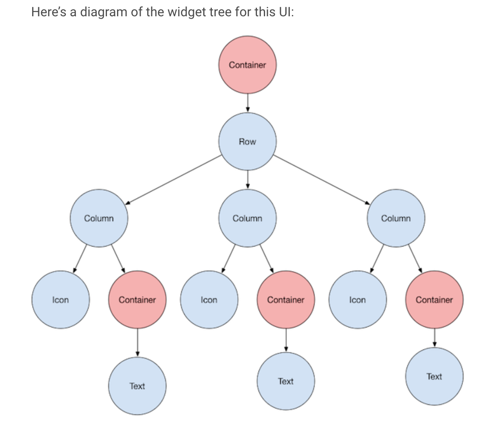

# 20-05-23. flutter

Created By: hyerim kim
Last Edited: May 24, 2020 12:22 AM

## How to set Appbar Height?

- using PreferredSize !!

[Flutter: Setting the height of the AppBar](https://stackoverflow.com/questions/51089994/flutter-setting-the-height-of-the-appbar)

```dart
class MyApp extends StatelessWidget {
  @override
  Widget build(BuildContext context) {
    return MaterialApp(
      title: 'Example',
      home: Scaffold(
        appBar: PreferredSize(
          preferredSize: Size.fromHeight(50.0), // here the desired height
          child: AppBar(
            // ...
          )
        ),
        body: // ...
      )
    );
  }
}
```

### PrefferedSize class

- A widget with a preferred size
- child 의 layout에 영향을 주지 않고, parent에 의해 사용되는 size를 advertise 한다

# cardview 만들기 전에

## Flutter's layout

[Layouts in Flutter](https://flutter.dev/docs/development/ui/layout)

- everything is a widget
- container
    - a widget class that can **customize its child widget**
    - add padding, margins, borders, background color ..



- all layout widgets → have either of the following
    - child - a single child
    - children - list of widgets

```dart
Center(
  child: Text('Hello World'),
),
```

- add the layout widget to the page
