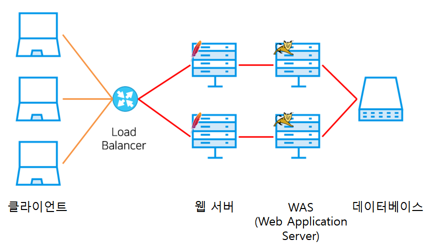
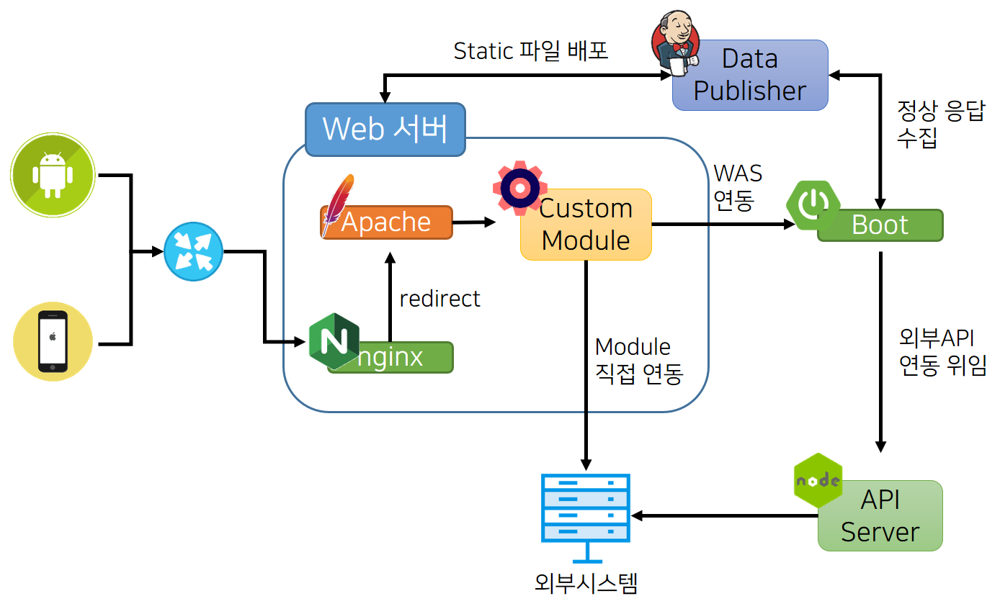

# 네이버 메인 페이지의 트래픽 처리 

by naver d2

요약 : 메인페이지의 갑작스러운 트래픽에 대응하기 위해 WAS의 부하를 줄이는 여러 방식을 도입했다. 예를 들어 웹서버의 기능을 이용하거나, 필요없는 리소스 요청을 막거나, 외부 api 의 실패가 메인 페이지의 장애로 이어지지 않게 차단하는 등의 기능을 추가했다.

아쉬운 점 : DB 로드에 대한 얘기는 크게 없었음  

[NAVER D2](https://d2.naver.com/helloworld/6070967?utm_source=gaerae.com&utm_campaign=%EA%B0%9C%EB%B0%9C%EC%9E%90%EC%8A%A4%EB%9F%BD%EB%8B%A4&utm_medium=social)

# 네이버 메인 페이지 상황

- 평상시 트래픽의 6배에 달하는 유입이 30여초 내에 일어남

# 네이버 메인 페이지의 분산 처리

- 로드 밸런서를 사용하는 일반적인 3-Tier
    - 클라이언트 → 로드밸런서 → 각 웹 서버로 분산
        - was는 동일한 DB를 참조함

- 각 구성 요소에 문제가 생기면?
    - 로드 밸런서 다중화, DNS 라운드로빈 방식을 적용해 문제를 처리함
    - WAS에 문제가 생겼을 때 웹 서버가 다른 WAS를 찾도록 해야함
        - 사용자가 로그인 했으면 was에 세션 클러스터링 설정
        - 세션 클러스터링 설정을 위한 추가 작업, 관리 지점 증가
    - DB도 다중화로 문제 해결 힘듦
        - 데이터 스토리지 다중화가 어려움
        - 샤딩 옵션이 있다면 데이터가 늘어날 때 기존 데이터 마이그레이션은 어떻게 할지 고민
        - noSQL이라면 정합성, 동기화, 장애 복구 등등을 고려해야 함

## 문제 해결 방법

### 고려한 사항

- 메인 페이지는 유저 별로 다를 필요가 없는 view역할을 함
    - 트랜잭션 고려 불필요
    - 그럼 특정 상탯값에 의존하면 안됨
- 무슨 일이 있더라도 사용자에게 제공해야 함
- 트래픽 증가에 탄력적으로 대응

## 사용 기술

- GCDN(Global CDN)
- SSI(Server Side Includes)
- Apache 커스텀 모듈
- 마이크로서비스(부분 도입)
    - 서킷 브레이커(circuit breaker)
    - 서비스 디스커버리(service discovery)

### GCDN

- CSS, Javascript 와 같이 업로드가 잘 변하지 않는 부분. 트래픽 부하 가중됨
- e.g 100KB * 10만 명 = 10GB 트래픽 발생
- 공통적으로 발생하는 리소스는 부하 분산을 위해 GCDN으로 분산
- 추가 GSLB 기능 : IP 주소에서 가장 가까운 CDN 서버를 자동으로 선정

### SSL

- Apache, Nginx 와 같은 웹서버에서 제공하는 서버사이드 스크립트 언어
- 서버의 특정 파일이나 쿠키 유무의 판별 등 간단한 기능
    - 이런 기능을 SSL로 처리하면 WAS의 부담을 줄일 수 있음

### Apache 커스텀 모듈

- Apache HTTP 를 APR(Apache Portable Runtime) 기반의 커스텀 모듈로 확장하여 사용
    - 운영체제와 독립되어 http 기반 통신을 처리하는 라이브러리
    - 메모리 할당, 폴링, 입출력, 멀티스레드 관련 처리
- 네이버에서는 간단한 외부 api 호출 결과를 그대로 사용할 때 사용하며, reverse proxy, AJP 대신 커스텀 모듈을 사용해 was가 다 문제가 생겨도 웹서버만 정상이면 서비스가 제공되는 형태로 was와 통신
    - AJP나 HTTP을 사용해 WAS와 통신하면 WAS와 통신이 실패했을 때 오류로 처리된다.
    - 커스텀 모듈을 사용하면 WAS와 통신이 실패했을 때 동일한 IDC에 있는 다른 WAS와 통신을 시도한다.
    - 다른 WAS와 통신도 실패하면 오류로 처리하는 대신 특정한 경로에 있는 파일을 읽어서 반환한다. 반환할 파일은 정적 파일을 배포하는 Data Publisher가 특정 시간 주기에 따라 웹 서버에 생성해 놓은 파일이다.
- 역시 WAS의 부담을 줄여줌

### 마이크로 서비스 부분 도입

- 외부 시스템과 API 연동을 담당하는 부분은 node.js 에서 처리
    - node.js를 통해 병렬 처리 스레드 문제를 고려 x
    - 비동기로 외부 시스템 연동 시 병렬로 여러개의 요청을 처리

### 서킷 브레이커

- 외부 서비스의 장애로 인한 연쇄적 장애 전파를 막기 위해 자동으로 외부 서비스와 연결을 차단하고 복구하는 역할

### 서비스 디스커버리

- 동적으로 생성, 삭제되는 서버 instance에 대한 IP 주소와 포트를 자동으로 찾아 설정
-