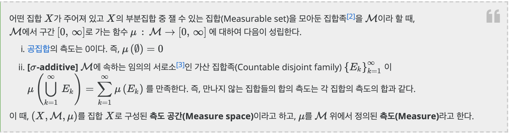
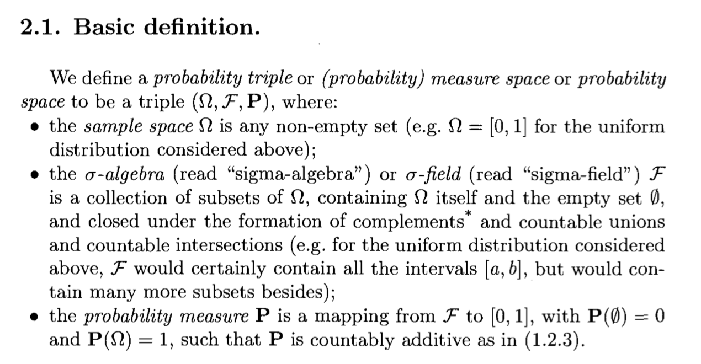
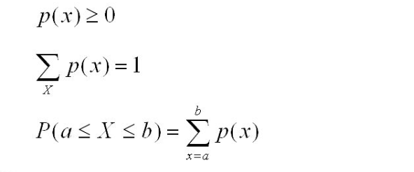
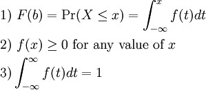

# 확률이 뭐지? 측도론(measure theory) 로 바라보는 확률

통계를 처음 접할 때 확률에 대해 설명을 합니다. 교과서에서의 확률은 동일한 조건에서 여러차례 반복할 수 있는 실험을 하고, 그 실험에서 나올 수 있는 모든 사건들 중에 해당 사건이 일어나는 비율이라고 배웁니다. 그리고 통계학 입문에서는 빈도주의냐 베이지안이냐에 따라서 확률의 정의가 주관적 확률이 될 수 있다고 얘기합니다. 내가 50%라고 믿으니 가능성은 50%야! 라구요. 으잉?

이렇게 다양한 설명이 존재하지만 저는 방정식을 푸는 것처럼 명쾌한 느낌을 받지 못했었습니다. 제 나름대로 이해하려고 하다가 측도론 분야를 알게 되었고 저는 측도론으로 바라보는 확률의 정의가 명쾌하고 마음에 들었습니다. 그래서 첫번째 포스팅 주제로 측도론과 확률의 정의로 글을 쓰기로 했습니다. 

# Measure Theory (측도론)

먼저 본론으로 들어가기에 앞서 Measure Theory가 무엇인지부터 아는 것이 좋겠네요. 이름에서 알 수 있듯이 측도론은 Measure(측도)를 연구하는 수학의 한 분야입니다. 보통 어떤 공간의 크기(Size)를 재는 방법을 연구하는 학문이죠. 우리는 보통 공간의 크기(size)를 측정하기 위해서 리만이 만들어낸 적분 (공간을 작은 조각들로 자르고 더하는 방식)을 이용하지만, 리만 적분으로도 그 크기를 잴 수 없는 함수들이 많아, 그 한계점을 해결하고 좀 더 엄밀한 정의를 부여하기 위해서 측도론이 발전하게 됩니다. (Lebesue)

### 측도: 어떤 집합의 부분집합을 넣으면 특정 숫자가 나오는 함수

조금 더 개념을 확장해 볼까요? 앞에서 얘기한 공간을 집합으로 정의하고, 측도는 그 집합 위에 정의된 숫자(number)라고 얘기해 봅시다. 측도는 어떤 집합이 있고 그 집합은 수많은 부분 집합(subset)을 가질 수 있는데 그 가능한 모든 부분집합에 대해 숫자를 체계적으로 할당 해주는 시스템 입니다. 측도가 그 집합의 크기를 재는 함수가 되려면 몇가지 추가적인 정의가 필요합니다. 

위키피디아에서는 아래와 같이 정의하고 있습니다. 

먼저, 아무것도 포함하지 않은 공집합의 측도는 0이어야 합니다. 아무것도 없는 것의 크기는 0이라고 정의하는 것입니다. 

그리고 서로 교집합이 없는 **집합들의 합의 크기는 각각의 크기의 합**이라고 정의합니다. 

이 때 주어진 집합과 그 부분집합들 (all subsets), 그리고 측도가 정의된 공간을 우리는 **측도 공간(Measure space)**라고 합니다. 

예를 들어, 고등학교 한 반에 있는 모든 사람들에 대해 무게라는 측도를 정의한다고 합시다. 그렇다면 여기서 전체 집합은 이 반에 있는 전체 사람들이고, 아무도 없으면 그들의 무게는 0입니다. 

그리고 1명, 1명 잰 무게의 합은 2명이 동시에 잰 무게의 합과 같습니다. 

 그 때 무게는 그 반에 있는 사람들을 숫자로 매핑하주는 함수, 즉 측도가 됩니다.

# Probability (확률)

**그렇다면 확률은 Measure theory 관점에서 어떻게 정의할 수 있을까요?** 

**확률은 측도(Measure)의 대표적인 케이스**입니다. 그리고 그 **측도가 정의되는 공간은 Sample space** 라고 합니다. 

Sample space이 되기 위한 조건은 그렇게 까다롭지 않습니다. 단순히 **non-empty set**이면 됩니다. 

예를 들어, Uniform 분포의 Sample Space(분포의 정의역)는 단순히 0 이상의 구간이면 됩니다.  

여기서 [0,3] 을 정의역으로 가지고 있는 Uniform 분포를 예로 들어 보겠습니다. 

이 구간의 **부분집합**은 바로 [0,3] 에 포함된 모든 구간일 것입니다. (All intervals contained in [0,3]).

이 때 확률 P는 [0,3]에 포함된 구간들을 [0,1]로 매핑시켜주는 함수이고, 측도론의 정의에 따라 자연스럽게 P(empty set) = 0 이고,  P(sample space) = 1이 됩니다. 

즉, 위의 Measure Space의 정의에서 달라지는 점은 확률이라는 측도는 이 **집합을 [0,1]로 매핑시켜주는 함수**라는 것입니다. 

그리고 이 때의 Sample Space, Sample Space에서 파생되는 모든 부분집합, 확률을 우리는 **Probability Measure Space** 라고 정의내릴 수 있습니다. 

## Just "Probability Allocation Function", not pdf or pmf

우리가 기존에 배웠던 연속확률함수(Probability Density Function), 이산확률함수(Probability Mass function)의 조건을 생각해 봅시다.  

(좌) Properties of PMF , (우) Properties of PDF

측도론의 관점에서 이 조건들은 매우 당연합니다. 

확률은 측도이기 때문에 항상 0이상이며, 모든 Sample space에 할당된 확률의 합은 1이 됩니다. 

또한 이산 변수 일 때 어떤 구간에 대한 확률은 각 변수에 할당된 확률의 덧셈으로, 연속 변수 일 때는 적분(infinite sum of real number)으로 표현하는 것 또한 당연하게 느껴집니다. 

 참고로, 위키피디아에서의 적분의 정의는 다음과 같습니다. 

적분(積分, 영어: Integral)은 ... 실수의 척도를 사용하는 측도 공간(**Measure Space**)에 나타낼 수 있는 연속인 함수 f(x)에 대하여 그 함수의 **정의역의 부분 집합**을 이루는 구간 [a, b] 에 대응하는 치역으로 이루어진 곡선의 리만 합의 극한을 구하는 것이다.

# References (참고자료)

[Measure Theory for Probability: A Very Brief Introduction - Count Bayesie](https://www.countbayesie.com/blog/2015/8/17/a-very-brief-and-non-mathematical-introduction-to-measure-theory-for-probability)

A First Look at Rigorous Probability Theory

Bayesian Deep Learning Course 1 in Edwith 

[https://www.edwith.org/bayesiandeeplearning/lecture/24684/](https://www.edwith.org/bayesiandeeplearning/lecture/24684/)   

[https://ko.wikipedia.org/wiki/적분](https://ko.wikipedia.org/wiki/%EC%A0%81%EB%B6%84)
